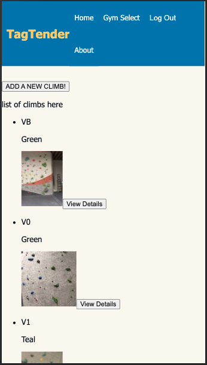
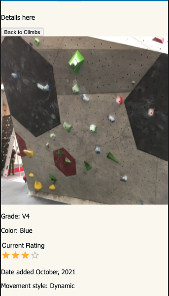
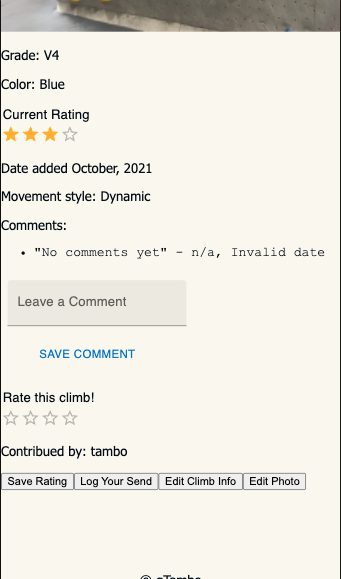

# Tag Tender

## Description

_Duration: 2 Week Sprint_

Rock climbing routes come in a wide variety of difficulty, quality, and style, both outdoors and in climbing gyms. Climbers outdoors have well-known resources available to them to gain information about these route specifics. Indoor climbers have fewer well-known options
The Tag-Tender app is intended to give indoor climbers a way to view and keep track of inddor climbing routes and their relative information. Major features of the app will include a user’s ability to view route details and leave three types of feedback on a given route: perceived grade accuracy, rank overall quality, and optional additional comments. After submission, users will also be able to review their feedback and edit or remove it. Future features will include a climber's personal logbook.


## Screen Shot

The current state of the climb list view (for mobile):


and a peek at the Climb Details page:



### Prerequisites

Link to software that is required to install the app (e.g. node).

- [Node.js](https://nodejs.org/en/)
- [AWS S3](https://s3.console.aws.amazon.com/s3/home)
- [Postgres](https://www.postgresql.org/download/)
- Optimized for viewing with Google Chrome

## Installation

How do you get your application up and running? This is a step by step list for how another developer could get this project up and running. The good target audience in terms of knowledge, would be a fellow Primer from another cohort being able to spin up this project. Note that you do not need a paragraph here to intro Installation. It should be step-by-step.

If your application has secret keys (for example --  Twilio), make sure you tell them how to set that up, both in getting the key and then what to call it in the `.env` file.


1. Create a database named `tagtender_project`,
2. The queries in the `database.sql` file are set up to create all the necessary tables and populate the needed data to allow the application to run correctly. The project is built on [Postgres](https://www.postgresql.org/download/), so you will need to make sure to have that installed. We recommend using Postico to run those queries as that was used to create the queries, 
3. Create an IAM user and a bucket on Amazon S3 for storing photos
4. Create a `.env` file at the root of the project and paste this line into the file:
  ```
  SERVER_SESSION_SECRET=superDuperSecret
  ```
5. While you're in your new `.env` file, take the time to replace `superDuperSecret` with some long random string like `25POUbVtx6RKVNWszd9ERB9Bb6` to keep your application secure. Here's a site that can help you: [https://passwordsgenerator.net/](https://passwordsgenerator.net/). If you don't do this step, create a secret with less than eight characters, or leave it as `superDuperSecret`, you will get a warning.
6.  Replace`sample` in each of the following 4 lines  with the appropriate values from your S3 account, and include in you `.env`   file:  
    `AWS_ACCESS_KEY_ID=sample`
    `AWS_SECRET_ACCESS_KEY=sample`
    `AWS_REGION=sample`
    `S3_BUCKET=sample`
7. Make sure your `.env` is in your `.gitignore`!
8. Open up your editor of choice and run an `npm install`
9. Run `npm run server` in your terminal
10. Run `npm run client` in your terminal
11. The `npm run client` command will open up a new browser tab for you!
 


## Usage
How does someone use this application? Tell a user story here.

1. Create a new user on the register page, or login an existing user
2. Select the climbing gym and type of climbing you would like to view
3. Scroll through list of climbs, click or tap on one for more details
4. Click button to make edits if information is incorrect
5. Use 'Back' or "Cancel' button on any page to go back to climb list page
5. Click delete if climb no longer exists
6. Back on list of climbs, click add new climb if there is a climb you want to add
7. Fill in the basic info, then click add photo
8. Select a photo from your device for the climb, and save it
9. Home button on the nav bar shows your profile information
10. Logout button on the nav bar logs you out of the application.


## Built With

List technologies and frameworks here

1. JavaScript
2. React
3. Redux
4. AWS S3/aws-sdk
5. Material-UI
6. Express
7. Postgres
8. SQL
9. HTML/css


## Acknowledgement
Thanks to [Prime Digital Academy](www.primeacademy.io) who equipped and helped me to make this application a reality. Thanks to the Proth cohort

## Support
If you have suggestions or issues, please email me at [youremail@whatever.com](www.google.com)